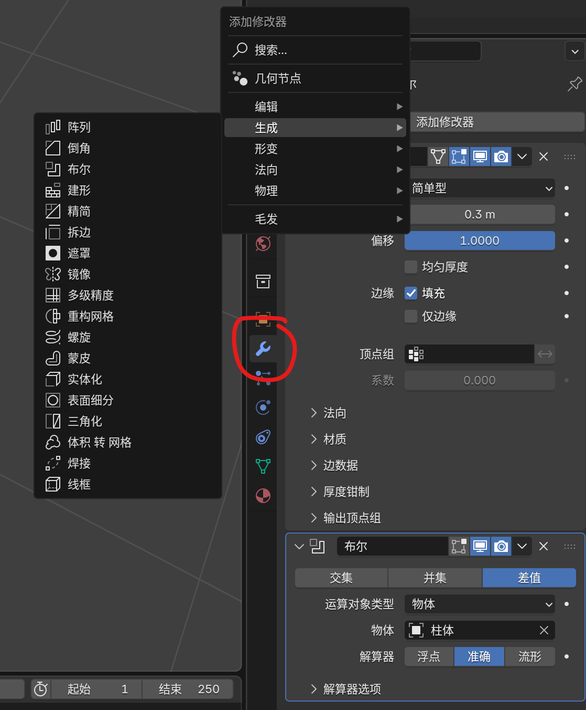

# Blender笔记

课程网址链接🔗

https://www.bilibili.com/video/BV14u41147YH/?spm_id_from=333.337.search-card.all.click&vd_source=dec0df5946c5a4e7864de4bc96371c49

## 模型三要素

模型、灯光、摄像机

## 视角操作

- 以物体为中心移动视角 = 鼠标中键
- 移动视角 = shift + 鼠标中键
- 放大缩小视角 = 鼠标滚轮
- 点击右侧小工具

## 模型操作

尽量在编辑模式下旋转、缩放。

- 点击左侧小工具
- 删除模型 = x/DEL
- 新建模型 = shift + a
- 移动模型 = g
- 只沿x/y/z轴移动模型 = g + x/y/z
- 缩放模型 = s
- 保护住x/y/z轴，其他轴缩放 = shift + x/y/z
- 只沿x/y/z轴缩放模型 = s + x/y/z
- 旋转模型 = r
- 只沿x/y/z轴旋转模型 = r + x/y/z
- 撤销移动/缩放/旋转 = alt + g
- 隐藏模型 = h
- 撤销隐藏模型 = alt + h
- 隐藏没有被选中的模型 = shift + h
- 移动复制 = shift + d
- 多种选择模型的方式
- 吸附网格移动 = g + ctrl + 鼠标拖动

## 切换视图

- ～
- alt + 按住中键并拖动鼠标
- 点击右边的xyz顶点
- 数字键盘

## 方便地调整摄像头

选中摄像头后，按N，进入视图并选择锁定摄像头

## 基本工作流

建模->布光->材质->渲染

## 管理工作区页面

- 鼠标移到工作区角落上，出现十字后，往自己的方向拉 = 分裂出自己的新工作区，往别人的方向拉 = 把别人合并为自己的新工作区。

  选择顶栏加号以新建工作区，右键删除以删除工作区。

- 最大化当前选中的工作区 = 鼠标左键选择工作区 + ctrl + space

## 游标操作

游标的作用：用于模型定位/用作模型的原点。

- 控制游标 = 在物体模式下 shift + 右键/在编辑模式下移动模型
- 切换到游标模式  = shift + 空格 + 空格
- 控制所选物体到游标 = shift + s
- 游标定位至世界原点 = shift + c
- 在模型上方选择变换轴心点 = 

## 改变模型的原点

blender只通过原点来识别模型。

1. 选中模型并勾选原点 = 
2. 选择模型，按g

## 以鼠标为视角放大缩小中心

## 选择物体为旋转中心

## 变换轴心点

- 边界框中心
- 3D游标
- 各自的原点
- 质心点：重心点
- 活动元素：最后选中的那个模型

## 坐标轴切换

1. g + x/y/z是全局坐标
2. g +  x/y/z +  x/y/z是局部坐标
3. 单独查看选中物体 = /

## 禁用内容被选中

1. 用

## 启用以摄像机视角定位

1. 在工作区按N
2. 勾选摄像机到视图方位

## 摄像机属性操作

- 修改摄像机分辨率 = 修改右侧属性栏中格式的xy
- 修改摄像机外视角的不透明度 = 修改外边框属性

## 渲染

blender自带两个很好用的渲染引擎：EEVEE & CYCLES

EEVEE：

优：快，相对不占资源。

缺：没有光线追踪，很多光线阴影的细节不佳。

CYCLES：

优：逼真，能模拟出物理世界中非常细节的光线阴影。

缺：慢，吃硬件资源。

- 选择渲染引擎。
- 渲染快捷键 = F12
- 工作区内四种预览方式
- 设置渲染设备 = ctrl + ，打开系统CUDA。
- 可以调整视图和渲染的采样数值，以减少渲染压力。

## 复制已有材质给模型

1. 先点击接受材质的模型，后shift + 点击给材质的模型
2. ctrl + L，关联材质。

## 建模模式切换快捷键

1. 偏好设置中设置Tab键调用饼菜单。
2. 键盘1、2、3可以分别选择点、线、面。

## 编辑模式操作

- 撤销刷选操作 = 鼠标中键以取消已刷选的部分
- 反选已选择的部分 = ctrl + I
- 两点/线/面之间的最短路径 = 鼠标左键选择一点/线/面 + ctrl + 鼠标左键选择一点/线/面
- 选择相连元素 = L
- 循环选择点/线/面 = 鼠标左键选择一个点/线/面  + alt + 纵向/横向点击（纵向/横向循环选择）
- 循环选择同向异面的线 = ctrl + alt + 点击选择线
- 随机选择等选择方式 = 
- 切换至透视模式 = alt + z
- 切换至透视模式后可以选择到模型后的点/线/面
- 删除点/线/面 = x
- 扩大选择点/线/面 = ctrl + 小键盘+号
- 取消选择的点/线/面 = shift + 左键

## 法向

法线是用来区分面的正反。

- 打开面朝向后，反面是红色。
- 改变法向 = shift + n
- 显示法线

## 四大操作

### 挤出

- 挤出操作快捷键 = E/ctrl + 鼠标右键
- 挤出实际上是新增点/面/线，一旦E出东西后，一次撤销可能不够，需要再按一次确保E出来的新的部分被消除了。

### 内插

- 内插操作快捷键 = I

### 循环切割

- 循环切割操作快捷键 = 选择线后，ctrl + r。滑动滚轮可以设置切割多少块。

### 倒角

- 倒角操作快捷键 = 选择线后，ctrl + b。滑动滚轮可以设置倒角有多少个切面。
- ctrl + b不仅可以做倒角，还可以做柱体的分段切割。

## 六小操作

### 合并

- 快捷键 = M

### 断开

- 快捷键 = V

### 填充

- 快捷键 = F
- 栅格填充（前提是填充面的周围必须是偶数边） = ctrl + F

### 切刀

- 快捷键 = K
- 回车/空格键 = 退出切刀工具

### 桥接

桥接的前提是必须是同一模型的点/面/线。

- 桥接快捷键 = ctrl + E
- 组合为同一模型的快捷键 = ctrl + J

### 分离

- 快捷键 = P

## 常用修改器

修改器的作用：不修改原模型，也能渲染出想要的模型。多用于多次方案的修改。

### 修改器展开折叠快捷键

长按鼠标左键向修改器页面滑动

### 表面细分修改器

有两个属性：层级视图和渲染。层级视图负责渲染前的面数显示。渲染负责渲染后的面数显示。可以用来节省计算机性能。

- 快捷键 = ctrl + 2

### 实体化修改器

一般用来修改模型的厚度。

### 倒角修改器

### 布尔修改器

偶尔会出现很奇怪的问题，慎用。

1. 给模型设置布尔修改器。
2. 设置布尔修改器的物体（吸管图标）。

### 简易形变修改器

### 十分注意：在物体模式下修改缩放后，要记得应用缩放。

ctrl + a，选择应用缩放。可以按N查看缩放是否被应用。

### 设置模型的父子集关系

shift + 点选模型，第一个点的模型是子，第二个点的模型是父。

### 

### 面吸附

- 如图设置：

### 衰减编辑

- 快捷键o。按G/R/S后，滚轮可以调整影响的范围。

### 将选中的所有点沿x/y/z轴对齐

- 沿x/y/z轴对齐 = s + x/y/z + 0

### 随机渲染物品颜色

- 

### 旋绕

- d
- 使用副本 = 类似于不显示连续的轨迹

### 缩裹修改器

一般用于将一个面裹到另一个模型上，例如树根上的苔藓。

如果要使用缩裹修改器，该平面的细分一定得足够多。

### 阵列修改器

用来生成同等间隔的一组模型。

#### 相对偏移

#### 恒定偏移

#### 物体偏移

### 镜像修改器

用来生成镜像对称的一组模型。

### 晶格修改器

用来控制一组模型的形变。例如叶子。

- 将创建好的晶格包住模型后，ctrl + p 选择晶格形变。
- 编辑模式下调整好形变
- 物体模式下右键模型，选择转换为->网格
- 删除晶格

(Tips：笔者在做棕榈叶的时候发现给叶杆应用简易形变不生效，原因是没做细分)

### 曲线

blender将网格和曲线视为两种不同的类。

#### 贝塞尔曲线/圆环

类似于PS中的钢笔工具，是用长柄控制曲线走势的。

- 连接已有的两个端点 = 选中两个点 + F / 选中曲线的任何一个点 + alt + c
- 断开连接好的线 = 选择两个点 + x + 删除分段

#### NURBS曲线/NURBS圆环

是用顶点控制曲线走势的。有一个专门的“W”参数，用于控制曲线的曲率。

#### 用贝塞尔曲线/NURBS曲线做一根管子

- 几何数据中的“深度”控制管子的直径。

- 几何数据中的“分辨率”控制管子的平滑度。

- “填充封盖”控制管子的一端封不封闭。

  

- 控制管子不同点的粗细 = alt + s

#### 用NURBS曲线做异形倒角的管子（常用于制作头发）

1. 新建一个NURBS曲线

2. 新建一个贝塞尔圆环，并在编辑模式下细分、修改顶点，做出想要的横截面。

3. NURBS曲线倒角选项中选择物体，并将吸管选择贝塞尔圆环。

4. 控制顶点的粗细 = alt + s

   

### 曲线修改器

使用曲线修改器 + NURBS路径曲线，改变棕榈叶的弯曲效果。

- 创建好棕榈叶模型
- 创建 NURBS路径曲线
- 创建曲线修改器
- 将曲线修改器的曲线物体设置为棕榈叶

### 父子级关系

#### 物体：

改变父级关系后，子级撤销所有旋转形变等。

#### 物体（保持变换）：

改变父级关系后，子级保持以往的旋转形变等。

#### 物体（无反向）：

改变父级关系后，无旋转形变地子级原点与父级原点重合。

#### 物体（保持变换无反向）：

改变父级关系后，保持旋转形变地子级原点与父级原点重合。

#### 顶点

#### 顶点（基于三点）

#### 做藤曼

- 关联性复制 = alt + d（与shift d复制不同于改变原模型所有复制体都会变）
- 重复做棕榈叶的操作，与做棕榈叶不同，藤曼父子级设置时要选顶点（基于三点）

### 蒙皮修改器

一般用于直接建出一个框架/做树枝。

1. 新建一个平面，M合并出一个顶点，E挤出多个顶点。
2. 添加蒙皮修改器。
3. E挤出顶点用于制作分叉。
4. 增加分叉半径 = ctrl + a。

### 置换修改器

多用于设置一个平面的材质。

1. 将一个平面细分成多块。（进入编辑模式细分多份/物体模式下新增表面细分修改器）
2. 在置换修改器贴图属性中新建贴图
3. 微调参数

#### 做石头

1. 将置换修改器应用至一个立方体
2. 置换修改器纹理选择沃洛诺伊图，间隔矩阵选择平方间隔。

### 制作小狐狸

- 按原有路径滑动 = 双击g
- 设置原点 = shift + d